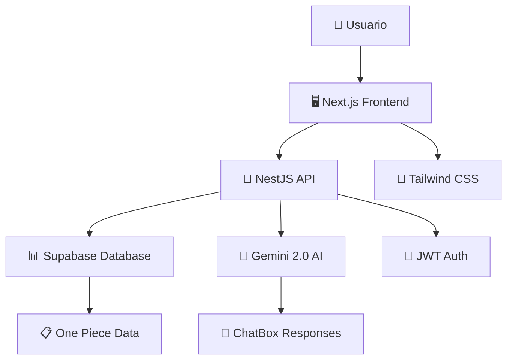

# 🏴‍☠️ One Piece API & AI ChatBox

<div align="center">
  
  
  ### ⚔️ API completa de One Piece con ChatBox inteligente powered by Gemini 2.0
  
  [](https://nextjs.org/)
  [](https://nestjs.com/)
  [](https://www.typescriptlang.org/)
  [](https://supabase.com/)
  [](https://deepmind.google/technologies/gemini/)
  
  <br/>
  
  [](https://github.com/albertomarin)
  [](LICENSE)
  [](https://github.com/albertomarin/onepiece-api)
  
</div>

---

## 🎯 ¿Qué es este proyecto?

Una **API REST completa** del universo de One Piece que incluye información detallada sobre personajes, frutas del diablo, arcos narrativos, tripulaciones y mucho más. Además, cuenta con un **chatbox inteligente** que utiliza **Gemini 2.0** para responder todas tus dudas sobre el mundo de los piratas más famoso del anime/manga.

### ✨ Características Principales

- 🔍 **API REST completa** con datos exhaustivos de One Piece
- 🤖 **ChatBox AI** powered by Gemini 2.0 para consultas inteligentes
- 📱 **Frontend responsive** con Next.js 14 y App Router
- ⚡ **Backend robusto** con NestJS y TypeScript
- 🗄️ **Base de datos escalable** con Supabase
- 🔐 **Autenticación segura** y gestión de usuarios
- 📊 **Panel de administración** para gestionar contenido
- 🎨 **UI/UX moderna** con Tailwind CSS

---

## �️ Mi RoadMap de Desarrollo

<div align="center">

### 📚 Stack Tecnológico que estoy dominando

| Tecnología | Estado | Descripción | Recursos |
|------------|--------|-------------|----------|
|  | **Completado** | Fundamentos y tipos avanzados | [Mi progreso](./docs/typescript-progress.md) |
|  | **En progreso** | Next.js 14, App Router, Server Components | [Mi progreso](./docs/nextjs-progress.md) |
|  | **Siguiente** | API REST, Guards, Interceptors | [Planificado](./docs/nestjs-roadmap.md) |
|  | **Siguiente** | Database, Auth, Real-time | [Planificado](./docs/supabase-roadmap.md) |
|  | **Final** | AI Integration, Prompt Engineering | [Planificado](./docs/gemini-integration.md) |

</div>

---

## 🛠️ Arquitectura del Proyecto

<div align="center">



</div>

---

## 🏴‍☠️ Funcionalidades de la API

### 👥 Personajes
- **Mugiwara no Ichimi** (Tripulación del Sombrero de Paja)
- **Yonko** y sus tripulaciones
- **Marines** y Almirantes
- **Shichibukai** y ex-miembros
- **Revolucionarios**
- **Supernovas**

### 🍎 Frutas del Diablo
- **Paramecia** - Poderes sobrenaturales
- **Zoan** - Transformaciones animales
- **Logia** - Control de elementos naturales
- **Frutas Especiales** y **Despertares**

### 🗺️ Arcos y Sagas
- **East Blue Saga**
- **Alabasta Saga**
- **Water 7 Saga**
- **Thriller Bark**
- **Summit War Saga**
- **New World Saga**
- **Wano Country Arc**

### 🏝️ Islas y Ubicaciones
- **Grand Line**
- **New World**
- **Red Line**
- **Islas específicas** con detalles geográficos

---

## 🤖 ChatBox Inteligente

El chatbox utiliza **Gemini 2.0** para proporcionar respuestas contextualizadas sobre:

- 💡 **Consultas sobre personajes**: "¿Cuáles son los poderes de Luffy?"
- 🔍 **Búsquedas específicas**: "Muéstrame todas las frutas Logia"
- 📊 **Comparaciones**: "¿Quién es más fuerte entre Zoro y Sanji?"
- 🎯 **Teorías y análisis**: "¿Qué sabemos sobre el One Piece?"
- 📚 **Cronología**: "¿En qué orden ocurrieron los arcos?"

---

## 🚀 Instalación y Configuración

### Prerrequisitos
```bash
Node.js >= 18.0.0
npm >= 9.0.0
Git
Cuenta de Supabase
API Key de Google Gemini
```

### 1. Clonar el Repositorio
```bash
git clone https://github.com/albertomarin/onepiece-api.git
cd onepiece-api
```

### 2. Configurar Frontend (Next.js)
```bash
cd frontend
npm install
cp .env.example .env.local
# Configurar variables de entorno
npm run dev
# 🌐 Frontend: http://localhost:3000
```

### 3. Configurar Backend (NestJS)
```bash
cd backend
npm install
cp .env.example .env
# Configurar variables de entorno
npm run start:dev
# 🚀 API: http://localhost:3001
```

### 4. Configurar Base de Datos (Supabase)
```bash
# Ejecutar migraciones
npm run db:migrate
npm run db:seed
# 📊 Base de datos lista con datos de One Piece
```

---

## � Estructura del Proyecto

```
onepiece-api/
├── �️ frontend/                  # Next.js App
│   ├── app/                     # App Router
│   ├── components/              # Componentes UI
│   ├── hooks/                   # Custom Hooks
│   ├── lib/                     # Utilidades
│   └── styles/                  # Tailwind CSS
├── 🚀 backend/                   # NestJS API
│   ├── src/
│   │   ├── characters/          # Módulo personajes
│   │   ├── devil-fruits/        # Módulo frutas
│   │   ├── arcs/                # Módulo arcos
│   │   ├── chatbox/             # Módulo AI Chat
│   │   └── auth/                # Autenticación
│   └── prisma/                  # Schema de BD
├── � database/                  # Scripts de Supabase
│   ├── migrations/              # Migraciones
│   └── seeds/                   # Datos iniciales
├── 🤖 ai/                       # Configuración Gemini
└── 📁 docs/                     # Documentación
    ├── api/                     # Docs de API
    └── roadmap/                 # Mi progreso
```

---

## � Endpoints Principales

### 👥 Personajes
```typescript
GET    /api/characters           // Todos los personajes
GET    /api/characters/:id       // Personaje específico
GET    /api/characters/crew/:id  // Por tripulación
POST   /api/characters           // Crear personaje (Admin)
```

### 🍎 Frutas del Diablo
```typescript
GET    /api/devil-fruits         // Todas las frutas
GET    /api/devil-fruits/:type   // Por tipo (Paramecia, Zoan, Logia)
GET    /api/devil-fruits/:id     // Fruta específica
```

### 🤖 ChatBox AI
```typescript
POST   /api/chat/ask            // Enviar pregunta
GET    /api/chat/history        // Historial de chat
```

---

## 💭 Ejemplos de Uso del ChatBox

<details>
<summary><strong>🔍 Consulta sobre Personajes</strong></summary>

**Usuario:** "¿Cuáles son todos los poderes de Monkey D. Luffy?"

**Gemini AI:** "Luffy posee la fruta Gomu Gomu no Mi (ahora conocida como Hito Hito no Mi, Modelo: Nika), que le otorga:
- Cuerpo elástico como goma
- Inmunidad a ataques eléctricos
- Gears (Técnicas especiales):
  - Gear Second: Acelera su circulación
  - Gear Third: Infla sus huesos
  - Gear Fourth: Combina Haki y elasticidad
  - Gear Fifth: Despertar de su fruta (Forma Nika)
- Haki del Rey, Observación y Armamento dominados"

</details>

<details>
<summary><strong>⚔️ Comparaciones de Poder</strong></summary>

**Usuario:** "¿Quién ganaría entre Zoro y Mihawk actualmente?"

**Gemini AI:** "Actualmente, Dracule Mihawk seguiría siendo superior a Roronoa Zoro:
- Mihawk: El espadachín más fuerte del mundo
- Zoro: Ha crecido enormemente en Wano, pero aún aspira a superar a Mihawk
- Diferencias clave: Experiencia, dominio del Haki superior en Mihawk
- Predicción: Zoro está cerca, pero Mihawk mantiene la ventaja por ahora"

</details>

---

## 🎨 Capturas de Pantalla

<div align="center">
  
  
</div>

<div align="center">
  
  
</div>

---

## 📈 Mi Progreso Personal

### ✅ Completado
- [x] **TypeScript fundamentals** - Tipos, interfaces, generics
- [x] **React basics** - Hooks, componentes, estado
- [x] **Tailwind CSS** - Utility-first CSS framework

### 🔄 En Progreso
- [ ] **Next.js 14** - App Router, Server Components, SSR
- [ ] **React avanzado** - Context, Reducers, Performance
- [ ] **Diseño de UI/UX** - Componentes reutilizables

### 📋 Próximamente
- [ ] **NestJS** - Modules, Controllers, Services, Guards
- [ ] **Supabase** - Database design, Auth, Real-time
- [ ] **Gemini 2.0** - AI Integration, Prompt Engineering
- [ ] **DevOps** - Docker, CI/CD, Deployment

---

## 📞 Contacto y Seguimiento

<div align="center">

### 👨‍💻 Alberto Marin - Pirate Developer

[](https://www.linkedin.com/in/alberto-marin-morales/)
[](https://github.com/albertomarin)
[](https://twitter.com/albertomarin)
[](mailto:alberto.marin@example.com)

</div>

### �️ Sígueme en mi aventura
- 📝 **Blog de desarrollo**: Documentando cada paso de mi aprendizaje
- 🎥 **Videos de progreso**: Mostrando el desarrollo en tiempo real
- 💬 **Streams de código**: Programando en vivo este proyecto
- 📊 **Updates semanales**: Mi progreso con cada tecnología

---

## 🤝 Contribuciones

¿Eres fan de One Piece y desarrollador? ¡Únete a la tripulación!

1. 🍴 Fork el proyecto
2. 🌟 Crea tu rama (`git checkout -b feature/new-character`)
3. � Commit tus cambios (`git commit -m 'Add Gear 5 Luffy'`)
4. 📤 Push a la rama (`git push origin feature/new-character`)
5. 🔄 Abre un Pull Request

---

## 📜 Licencia

Este proyecto está bajo la Licencia MIT. Ver [LICENSE](LICENSE) para más detalles.

*Nota: Este es un proyecto de fans. One Piece pertenece a Eiichiro Oda y Shueisha.*

---

<div align="center">
  
  **🏴‍☠️ ¿Listo para navegar por el Grand Line del desarrollo? ¡Zarpa conmigo! ⚓**
  
  
  
  <sub>Hecho con ❤️ y mucho café ☕ por [Alberto Marin](https://github.com/albertomarin)</sub>
  <sub>*"I'm gonna be King of the Developers!"* 👑</sub>
  
</div>
